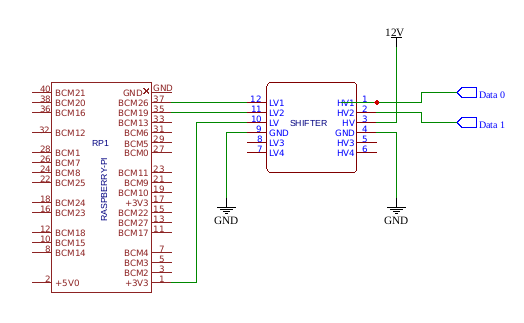

# Python Wiegand reader on Raspberry PI

Using GPIO you can read the key presses and card codes from a keypad with the Wiegand protocol.

[](https://pepy.tech/project/pywiegand)

# Requirements

* Raspberry PI OS
* WiringPI

# Wiring



# Install

```
pip install pywiegand
```

# Usage

```python
>>> from  pywiegand import WiegandReader
>>> wr = WiegandReader(6, 5)
# reading card
>>> wr.read()
'560019750914'

# reading keys
>>> wr.read()
['0', '1', '2', '3', '4', '5', '6', '7', '8', '9', '10', '#']
```
